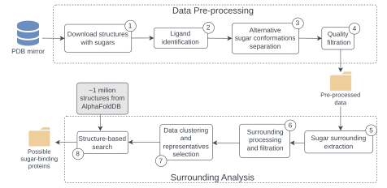

# SweetSeek

Structure-based detection of sugar-binding proteins

## Table of Contents

1. [Overview](#overview)
2. [Repository Structure](#repository-strcture)

## Overview

This project provides an automated bioinformatics workflow to identify candidate
sugar-binding proteins using structural data. The workflow consists of two main
stages: Data Pre-processing and Surrounding Analysis. The workflow steps are shown in this flowchart:



The project is split into two main parts:

- the workflow
- web application for interactively displaying workflow results

Each part is in its respective subdirectory. To read more about each part, view
their respective readmes ([workflow](workflow/README.md), [web app
frontend](web/fe/README.md), [web app backend](web/be/README.md)).

It is possible to run the workflow locally or on MetaCentrum infrastructure.
All parts of the project can be deployed/ran as docker containers.

## Repository Structure

```
SweetSeek/
│
├── workflow/
│ ├── pipeline_handlers/
│ ├── results/ (submodule)
│ ├── scripts/
│ ├── src/
│ │ ├── process_handlers/
│ │ ├── utils/
│ │ ├── config.json
│ │ ├── create_merged_results.py
│ │ ├── data_preprocessing.py
│ │ └── surrounding_analysis.py
│ ├── README.md
│ ├── Dockerfile
│ ├── requirements.txt
│ └── requirements-pymol.txt
├── web/
│ ├── docker-compose.yml
│ ├── fe/
│ │ ├── README.md
│ │ └── Dockerfile
│ └── be/
│   ├── README.md
│   └── Dockerfile
├── docs/
├── .gitignore
├── .gitmodules
└── README.md
```
